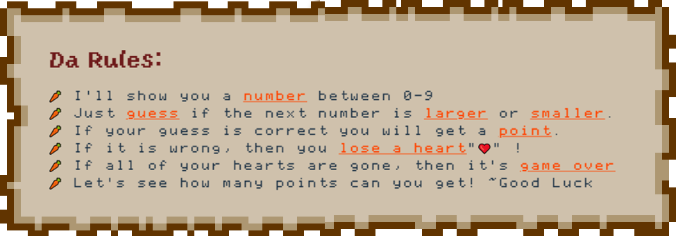
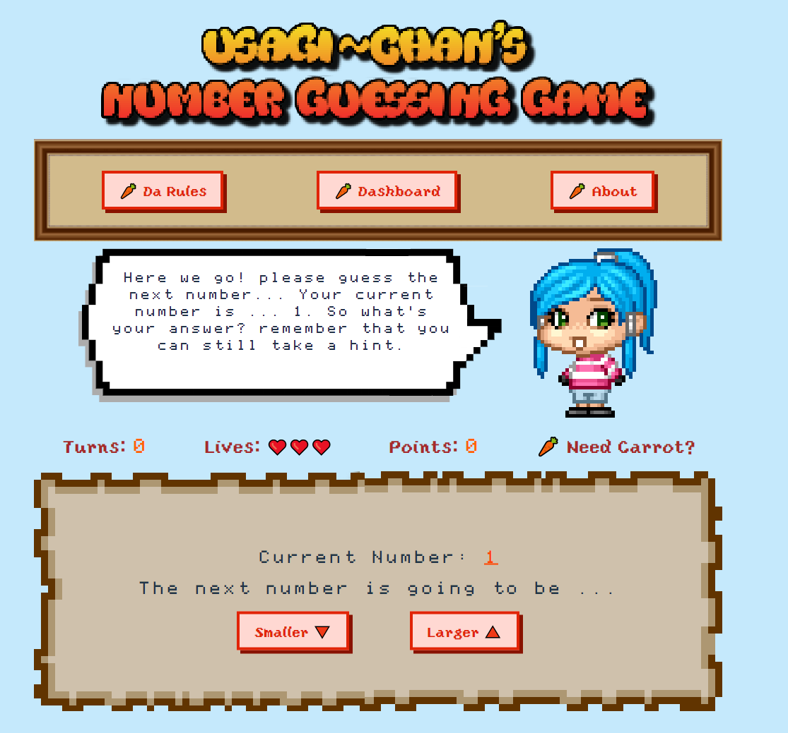
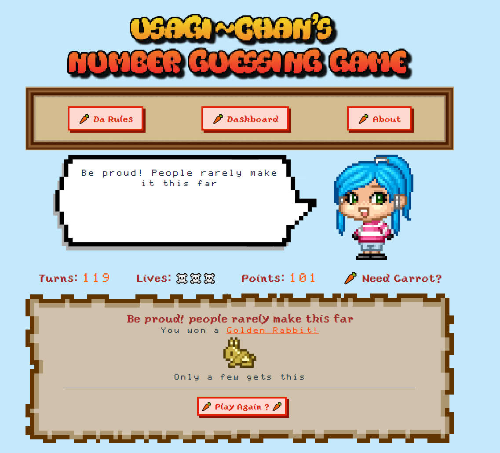

# Usagi San's ~ Number Guessing Game
This is a number guessing game where the player will be given a number and they will have to guess if the next number will be **larger** or **smaller**. Based on their answer they will either get a point or loose a life.

> You can view the deployed app [Here on Netlify](https://superlative-bunny-64511a.netlify.app/)

## Rules For The Game


## Game Preview



## Installation
This is a React.js project and uses `node==16.17.1` and `npm==8.15.0`. As the front end tooling software it uses [vite](https://vitejs.dev/)

Installation instructions are as follows:
1. cd into the root directory of the project
```
    cd Usagi-san_number_guessing_game
```
2. install all the dependencies using the following
```
    npm install
```
3. then just simply run the app using
```
    npm run dev
```

## Further Development
- [ ] Player Roster needs to be added in which players can save their records
- [ ] Only support desktop styling is present at the moment. Mobile browsers won't be pretty.
- [ ] any more ideas are welcome :)